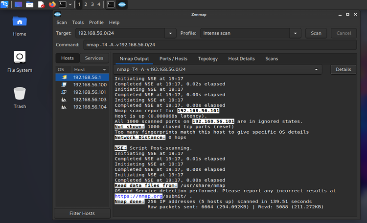
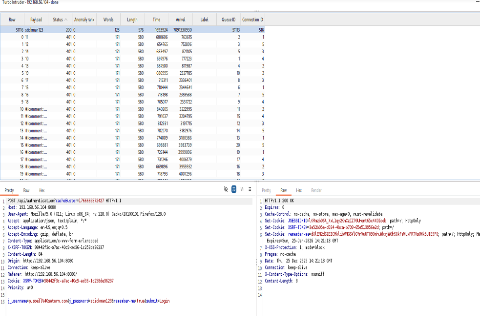

# Network_Penetration_Testing
Hands-on network penetration testing project using Nmap and Metasploit
##  Overview
This project demonstrates practical skills in network penetration testing using industry-standard tools in a controlled lab environment.

##  Tools Used
- Kali Linux
- Nmap
- Metasploit
- Zenmap

##  What I Did
- Performed network scanning and host discovery
- Identified open ports and running services
- Analyzed vulnerabilities in exposed services
- Simulated controlled exploitation scenarios

## Key Outcomes
- Identified security weaknesses in network services
- Demonstrated how misconfigurations can be exploited
- Proposed mitigation strategies to improve security

##  Screenshots

### Nmap Scan

### Exploitation Example

## 📄 Full Report
[View Full Report](./report/penetration-testing-report.pdf)

## ⚠️ Disclaimer
This project was conducted in a controlled lab environment for educational purposes only.
